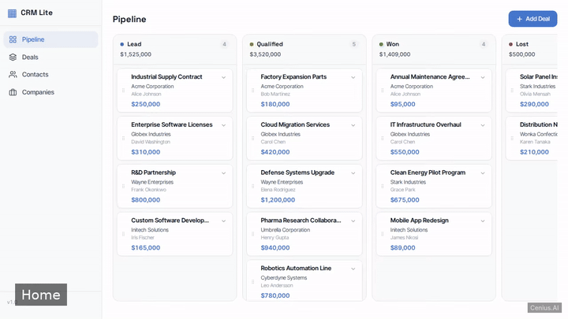
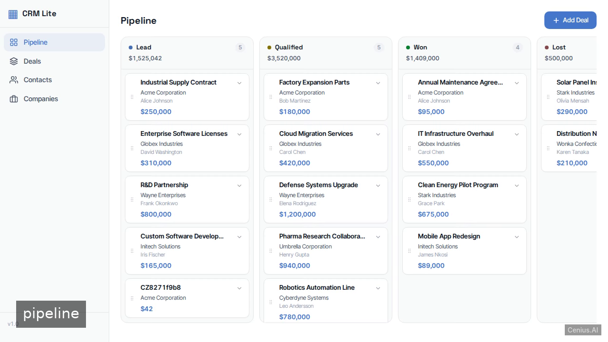
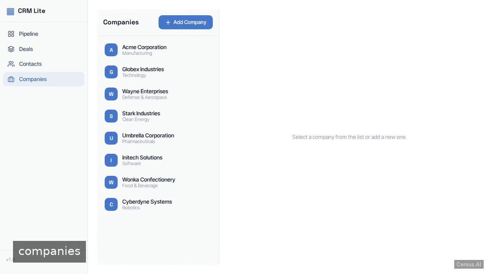

# CRM Lite — Full-stack app CRM system reference implementation

A Full-stack app CRM system, open-source and ready to self-host: that's **CRM Lite**. A browser-based CRM for sales teams to manage companies, contacts, and deals. CRM Lite ships complete — source, design assets, seed data — under the Apache-2.0 license; no cloud account needed. [Remix CRM Lite on cenius.ai](https://cenius.ai/marketplace/p/crm-lite?ref=gh&utm_campaign=crm-lite-webapp) for a custom build.


[](LICENSE)  [](https://cenius.ai)

[](https://cenius.ai/marketplace/p/crm-lite?ref=gh&utm_campaign=crm-lite-webapp)

> **▶ [Open & edit in cenius.ai](https://cenius.ai/marketplace/p/crm-lite?ref=gh&utm_campaign=crm-lite-webapp)** — one click to an editable workspace: describe changes in plain English, get an instant preview, one-click deploy and host. Modifications made on the platform come with full rebrand & relicense rights.

_Local clone? See [Quick start](#quick-start) below. cenius.ai is the zero-setup path._

## Demo



▶ **[Watch the full demo video](https://cenius.ai/marketplace/p/crm-lite?ref=gh&utm_campaign=crm-lite-webapp)** — the complete walkthrough, playing on the project's cenius.ai page · [MP4 file](.github/media/demo.mp4)

## Screenshots

  

## Quick start

```bash
./install.sh   # installs dependencies + seeds demo data
```

See [`INSTALL.md`](INSTALL.md) for full setup and usage instructions.

## Architecture

The repository contains 71 files of Full-stack app source, organised under `src/`. `install.sh` wires up dependencies and loads seed records; after it runs the app has real data to show. For environment-specific setup, see [`INSTALL.md`](INSTALL.md).

## Features

- Company Management
- Contact Management with Search
- Deal Management with Stages
- Pipeline Board with Drag-and-Drop
- Contacts List with Search

## Usage guide

Once the development server is running (see [INSTALL.md](INSTALL.md)), open your browser and go to `http://localhost:4200`.

The application provides the following views, accessible through the navigation:

- **Dashboard** – overview of key metrics (if configured).
- **Companies** – list of all companies with ability to add and edit entries.
- **Contacts** – searchable list of contacts; add and edit contact details.
- **Deals** – manage deals, each associated with a company and contact.
- **Pipeline Board** – visual Kanban-style board showing deals grouped by stage: *lead*, *qualified*, *won*, *lost*. Drag-and-drop (if implemented) to move deals between stages.

Use the links and buttons in the interface to navigate, create new items, edit existing ones, and manage your CRM data. The application stores data locally in the browser (IndexedDB or localStorage via the `StorageService`).

_Full guide: [`USAGE.md`](USAGE.md)_

## FAQ

### How do I self-host CRM Lite?

Grab the repo and run `./install.sh` — it handles packages and seed data in one go. After that, [`INSTALL.md`](INSTALL.md) walks you through starting the server. No external accounts required.

### Which framework or language does CRM Lite use?

Full-stack app. The full source in this repository is exactly what the app runs. Highlights include pipeline Board with Drag-and-Drop.

### Is CRM Lite editable without a developer?

Open it on [cenius.ai](https://cenius.ai/marketplace/p/crm-lite?ref=gh&utm_campaign=crm-lite-webapp) and describe the changes you want in plain English — the platform modifies the app and gives you a new, downloadable build.

### Is white-labeling CRM Lite allowed?

Yes. The MIT license lets you remove the original branding and ship under your own name. For a guided approach, [remix it on cenius.ai](https://cenius.ai/marketplace/p/crm-lite?ref=gh&utm_campaign=crm-lite-webapp): you get a fresh build with full rebrand and relicense rights.

### Is it OK to ship CRM Lite as part of a product?

Yes — it ships under the Apache-2.0 license, which permits commercial use, modification and redistribution. The full text is in [LICENSE](LICENSE).

## License & rebranding

Released under the [Apache License 2.0](LICENSE) (© 2026 Cenius AI) — free for personal and commercial use. The Cenius name/logo are trademarks (see NOTICE).

**Need a customized version?** [Remix this app on cenius.ai](https://cenius.ai/marketplace/p/crm-lite?ref=gh&utm_campaign=crm-lite-webapp) — modifications made on the platform come with **full rebrand & relicense rights** over your derivative.

## Built with cenius.ai

This entire application — code, design, seeded demo data — was generated on **[cenius.ai](https://cenius.ai)** from a plain-English description.

- 🚀 [Build your own app on cenius.ai](https://cenius.ai)
- 🎛️ [Remix CRM Lite on the marketplace](https://cenius.ai/marketplace/p/crm-lite?ref=gh&utm_campaign=crm-lite-webapp) — open it in a workspace, prompt for changes, and ship your own version.

More open-source apps: [the Cenius-ai catalog](https://github.com/Cenius-ai) · [showcase index](https://github.com/Cenius-ai/showcase)
